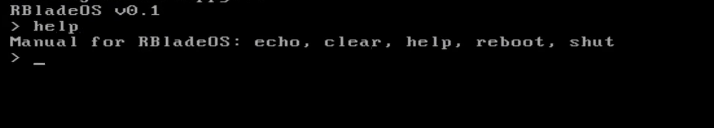
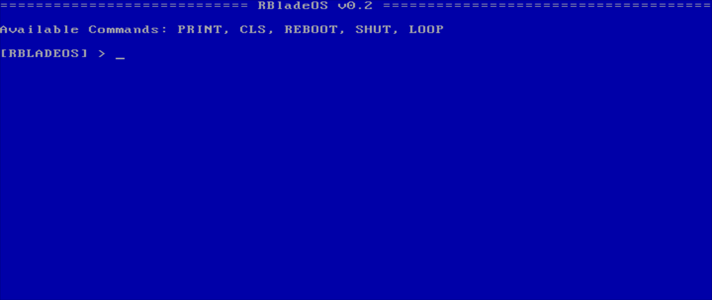
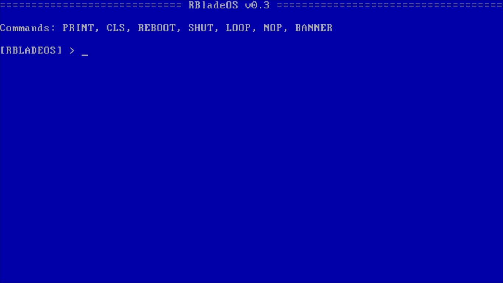

# Usage
`chmod +x build-linux.sh`

`./build-linux.sh`

Use qemu or Virtualbox to emulate the OS

Soon I will create a builder for windows.

# RBladeOS

RBladeOS is a mini kernel crafted in assembly language, aimed at demonstrating the principles of operating systems on the x86 architecture. 
RBladeOS serves as a hands-on tool for understanding the core mechanics of kernel functionality while utilizing minimal system resources.

# RBladeOS 0.1

Date: 02/10/2024

Integration of simple commands into your kernel such as echo, clear, reboot, shutdown, and help. 

Demonstration: https://www.youtube.com/watch?v=V4AOGu0INVw

# RBladeOS 0.2

Date: 15/10/2024

1. Change in Layout, now the background is blue and the banner is more prominent.

2. All commands like, echo, cls, reboot etc... were changeds and echo changed to "PRINT"

3. The "Unknown command" error message unfortunately has an error that is not displaying it, this will be fixed in future versions.

4. Now the kernel has a new command called "loop" that allows you to type things and they appear in a loop until you turn the system off and on.

5. The "help" command has been removed in this release and now all kernel commands are listed below the RBladeOS banner

6. 

7. # RBladeOS 0.3

8. Date: 30/11/2024

9. 1. In the RBladeOS bootloader, there is a welcome message saying that your choice to boot RBladeOS was great and he background is blue.
  
   2. 2 new commands have been added, being the "BANNER" and the "NOP" that the "BANNER" displays the banner on the screen, and the "NOP" is an infinite loop until you press 'q'
  
   3. Now in the command loop that are the "NOP" and "LOOP" instead of needing to restart the system to stop the command, just press "q" and the command is terminated.
  
   4. I intend in future versions to create a better interface for the RBladeOS kernel
  
   5. 

